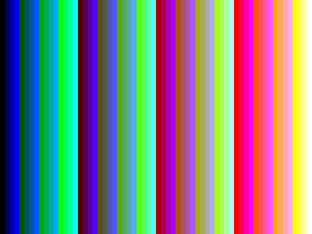
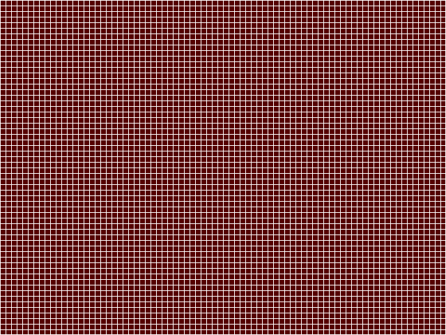
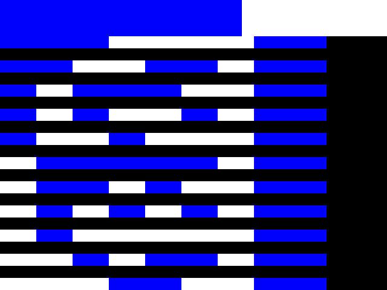
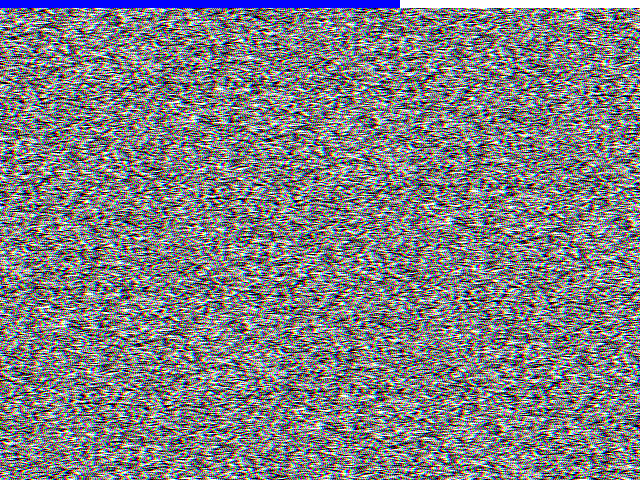
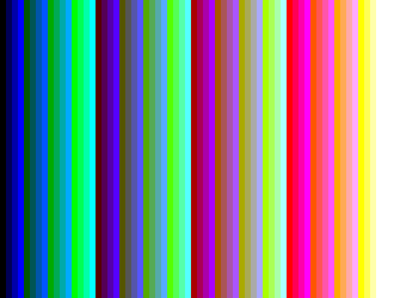

# The calibration loop closes: pixel-exact capture of a known design

Date: 2026-09-15. This is the end-to-end validation the project was built
for: a Verilog design of known content, synthesised to an iCE40UP5K
bitstream, loaded onto a real Tiny Tapeout FPGA emulation board at Welland,
captured through the demo board's PIO, streamed over USB, reconstructed by
`libvgaframe`, and compared pixel by pixel against the reference renderer
that describes what the design was supposed to draw.

Both designs matched **all 307,200 pixels** with no exceptions, no
tolerance and no alignment fudge.

## What ran

Board: fpga-1 (pi-sw2-p33), Tiny Tapeout demo board v3 (RP2350B, stock
MicroPython firmware) with the FabricFox iCE40UP5K breakout. Sampler on
PIO1 at a 500 kHz project clock, falling edge, 8 bits per sample.

```
# tunnel: ssh -N -L 18733:10.21.2.33:8765 tweed.welland.mithis.com
cd tt-vga-testpatterns
uv run --no-project python tools/upload.py http://127.0.0.1:18733 \
    bitstreams/tt_um_vgacal_bars.bin --enable --clock-hz 500000
cd ../vgacap
uv run ttcap capture ws://127.0.0.1:18733/serial --profile rp2350 \
    --design tt_um_vgacal_bars --clock-hz 500000 --seconds 10 --pio 1 \
    --out tmp/cal_bars_fpga1.vgacap
./build/vgacap-frames tmp/cal_bars_fpga1.vgacap tmp/calbars/f
cd ../tt-vga-testpatterns
uv run --no-project --with numpy --with pillow python tools/compare_capture.py \
    tt_um_vgacal_bars ../vgacap/tmp/calbars/f-0005.ppm
```

## Results

All five calibration designs were run this way, each a 10 s capture at a
500 kHz project clock with `overruns=0 rxstall=0` and 4,882,432 samples:

| design | detected mode | frames | comparison |
|---|---|---|---|
| `tt_um_vgacal_bars` | 640x480@60, both syncs negative | 10 | PASS, 307,200 pixels identical |
| `tt_um_vgacal_grid` | 640x480@60, both syncs negative | 10 | PASS, 307,200 pixels identical |
| `tt_um_vgacal_counter` | 640x480@60, both syncs negative | 10 | PASS, 307,200 pixels identical, on five consecutive frames |
| `tt_um_vgacal_prbs` | 640x480@60, both syncs negative | 10 | PASS, 307,200 pixels identical |
| `tt_um_vgacal_modes` | 800x600@60, both syncs positive | 5 | PASS, 480,000 pixels identical |

Four of the five are what the reconstruction library was told to expect.
The `modes` design is not: the demo board happened to drive `ui_in` = 1,
which selects 800x600@60 with positive syncs, and the library detected that
timing and both polarities from the signal alone, with no hint from the
host. The comparison then used `render.modes(1)` and matched all 480,000
pixels.

64 colour bars of 10 pixels each, the full 6-bit palette the Tiny VGA Pmod
can produce:



The one-pixel grid on a dark background, which is the strictest test of
sample phase and pixel alignment: a single clock of error anywhere in the
chain would smear or shift every line of it.



The frame counter design draws its own 8-bit frame number into the picture.
Five consecutive reconstructed frames decoded to counters 4, 5, 6, 7 and 8
and each matched the reference rendered for *that* counter, so no frame was
dropped, duplicated or reordered anywhere in the chain:



The pseudo-random design is the bit-error-rate test: its pixels come from a
16-bit LFSR reseeded each frame, so the picture has no redundancy at all to
hide a wrong sample. Every one of its 307,200 pixels was right.



The modes design at 800x600@60, the second timing and the positive-sync
case:



`bars-capture.vgacap.gz` is the full bars stream (4.9 MB raw, 28 KB
gzipped).

## Why this matters

Until now the pipeline had been checked against simulations of other
people's designs, where a disagreement could always be blamed on the
design's own timing (and once was: see `docs/research/` on the VGA
playground's sync phase). These designs were written against the VESA
timings the reconstruction library assumes, so a pixel-exact match means
the capture path itself, PIO sampling phase, DMA, chunk framing, stream
format, sync detection, active-area cropping and colour expansion, is
correct on real hardware.
