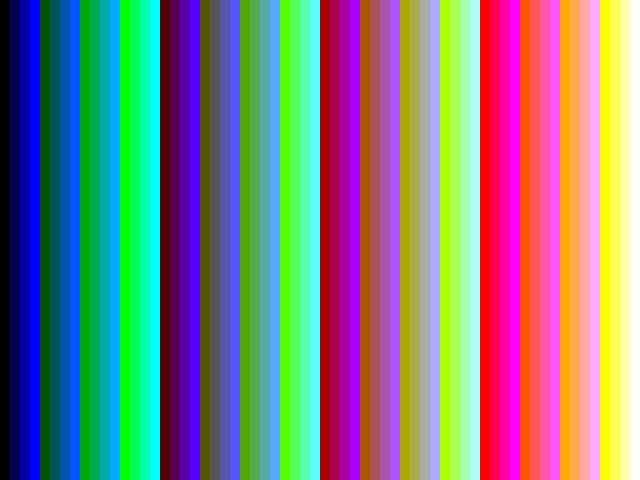

# The demo: a Tiny Tapeout board at Welland, to video

Date: 2026-09-15. This is the deliverable the project set out to build: one
command, pointed at a Tiny Tapeout board on the other side of the country,
producing video from whatever that board's design is drawing.

Board: fpga-1 (pi-sw2-p33, Tiny Tapeout demo board v3, RP2350B, stock
MicroPython firmware) with the FabricFox iCE40UP5K breakout running the
calibration design `tt_um_vgacal_bars`, reached through the `fpgas-tt`
debug bridge over an SSH tunnel.

```
ssh -N -L 18733:10.21.2.33:8765 tweed.welland.mithis.com
uv run ttcap demo --link ws://127.0.0.1:18733/serial \
    --design tt_um_vgacal_bars --clock-hz 500000 --seconds 12 --fps 5 \
    --profile rp2350 --outdir out
```

```
  mode 640x480@60: 800 clocks/line, 525 lines/frame, hsync negative, vsync negative, glitches 0
  1 frame(s), 3s elapsed
  6 frame(s), 5s elapsed
  ...
  48 frame(s), 13s elapsed

capture finished after 13.9s (gst-launch exit 0)
  51 png(s) in out
  out/capture.mkv, 19.8 KiB
```

The mode line is not configuration being echoed back: the reconstruction
library measured the sync timing from the captured signal and reported it
on the GStreamer bus.

## What comes out

`frame-0025.png` is one of the 51 frames, and it is **pixel-identical** to
the reference render of what that design draws. Not close, not visually
indistinguishable: all 307,200 pixels equal.



`capture.mkv` is the video file, 640x480, 10.2 s at 5 frames per second,
matching the requested `--fps 5`. Without `--fps` the video carries the
project's own time base instead, which at a 500 kHz clock is a frame every
0.84 s.

With `--serve PORT` the same capture also publishes an MJPEG stream a
browser can open; a live run served 32 JPEG frames to `curl` while writing
the files above.

## The whole chain

Every stage between the silicon and the video file is this project's:

1. A PIO program in the demo board's RP2350 samples the eight `uo_out`
   pins on each project clock edge.
2. Two chained DMA channels move the samples into SRAM with no processor
   involvement, and hard interrupt handlers re-arm them.
3. MicroPython frames the samples as `vgacap` stream chunks and writes them
   to USB, stopping cooperatively when asked.
4. `ttcap` on the host owns the serial link or the bridge, drives the board
   and streams the chunks onward.
5. `vgacapttsrc` runs that capture inside a GStreamer pipeline.
6. `vgadecode` wraps `libvgaframe`, which finds the sync pulses, measures
   the timing, locates the active area and expands six-bit colour to RGB.
7. Standard GStreamer elements encode, mux, display and serve it.

The calibration designs are what make the claim checkable: because the
Verilog was written against the VESA timings the reconstruction assumes,
"pixel-identical" is a statement about the capture path rather than about
agreement between two of our own guesses.
