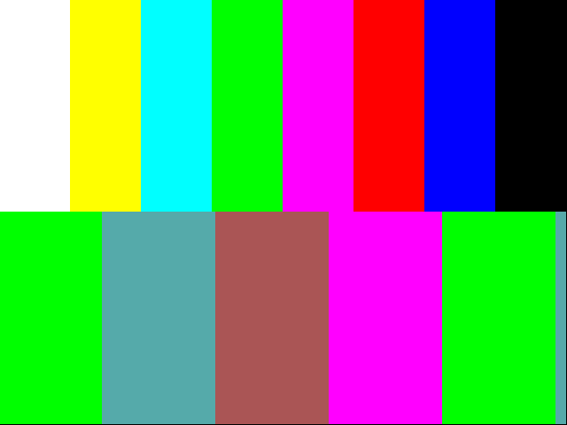

# First hardware capture: fpga-1 running `tt_um_vga_pattern`

Date: 2026-09-15. Board: fpga-1 at Welland (pi-sw2-p33, TT demo board v3,
RP2350B, stock MicroPython 1.29-preview / ttboard 3.1.0) with the FabricFox
iCE40UP5K breakout running the fpgas.online demo `tt_um_vga_pattern`
(640x480@60 colour bars over a scrolling 2-bit gradient). Project clock
500 kHz from the demo board's PWM. Sampler: PIO1 state machine 0 on the
falling clock edge, `in pins, 8` from GPIO33 (uo_out), two chained DMA
channels of 2048 words with module-level hard IRQ handlers, RAW chunks
over USB CDC through the fpgas-tt debug bridge and an SSH tunnel
(exploration path; `ttcap capture` on the Pi is the production path).

```
# tunnel: ssh -N -L 18733:10.21.2.33:8765 tweed.welland.mithis.com
uv run --project ../vgacap python tools/tt_capture_smoke.py ws://127.0.0.1:18733/serial \
    --profile rp2350 --design tt_um_vga_pattern --clock-hz 500000 --seconds 60 --pio 1 \
    --script tools/mp_capture_min.py --max-chunks 400 --out tmp/cap_fpga1_min3.vgacap
uv run --project ../vgacap --extra synth python tools/vgacap_stats.py tmp/cap_fpga1_min3.vgacap
../vgacap/build/vgacap-frames tmp/cap_fpga1_min3.vgacap tmp/cap3/f
```

Board-side rate 480 KB/s, 400 chunks (3,276,800 samples, 6.55 s of project
time) in 16.7 s wall clock, `overruns=0 rxstall=0`.

Stream statistics (`tools/vgacap_stats.py`):

```
hsync: high 0.8800, rising edges 4096, falling 4096
  rising-edge periods: [(800, 4095)]
  low-pulse widths: [(96, 2000)]
vsync: high 0.9961, rising edges 8, falling 8
  rising-edge periods: [(420000, 7)]
  low-pulse widths: [(1600, 8)]
```

`vgacap-frames`: six complete frames,
`640x480 mode=640x480@60 cpl=800 lpf=525 hsync=neg vsync=neg partial=0`.
Frame 4 (top half: eight colour bars white, yellow, cyan, green, magenta,
red, blue, black; bottom half: the gradient at that frame's scroll offset):



Sampled pixels (x, y) -> RGB: (40,100) white, (120,100) yellow, (200,100)
cyan, (600,100) black, (100,300) (0,255,0), (300,300) (170,85,85),
(500,300) (0,255,0). `capture.vgacap.gz` is the full stream (3.3 MB raw,
18 KB gzipped: the picture is extremely repetitive, which is what the
compression milestone will exploit).

What it took to get here is in
`docs/research/2026-09-15-rp2350-micropython-pio-findings.md`: the PIO
block's GPIO base must be set for real (clear the block's programs first),
`in_base` and `wait gpio` take absolute GPIO numbers on this firmware, the
clock pad must not be reconfigured, and hard IRQ handlers must be
module-level functions.

`tt-vga-capture` commit with these tools: see git log; `vgacap` 5893c61.
