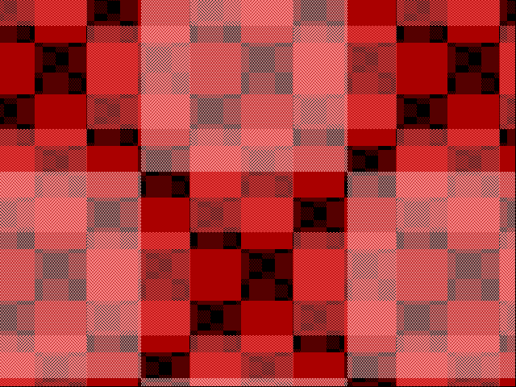

# First silicon capture: tt07 running `tt_um_rejunity_vga` (VGA Checkers)

Date: 2026-09-15. Board: tt07 at Welland (pi-sw2-p7, TT demo board, RP2040,
stock MicroPython v1.24.0 / ttboard 2.0.4), Tiny Tapeout 7 chip, project
`tt_um_rejunity_vga`. Project clock 60 kHz (the RP2040 firmware's USB CDC
path sustains ~114 KB/s here at two bytes per sample). Sampler: PIO1 SM0,
falling clock edge, `in pins, 12` from GPIO5 (uo_out[3:0], ui_in[3:0],
uo_out[7:4]), two chained DMA channels of 1024 words, module-level hard
IRQ handlers, RAW chunks over USB CDC through the debug bridge and an SSH
tunnel (exploration path).

```
# tunnel: ssh -N -L 18765:10.21.2.7:8765 tweed.welland.mithis.com
uv run --project ../vgacap python tools/tt_capture_smoke.py ws://127.0.0.1:18765/serial \
    --profile rp2040 --design tt_um_rejunity_vga --clock-hz 60000 --seconds 200 --pio 1 \
    --buf-words 1024 --script tools/mp_capture_min.py --max-chunks 720 --out tmp/cap_tt07_checkers2.vgacap
uv run --project ../vgacap --extra synth python tools/vgacap_stats.py tmp/cap_tt07_checkers2.vgacap
../vgacap/build/vgacap-frames tmp/cap_tt07_checkers2.vgacap tmp/cap5/f
```

720 chunks, 1,474,560 samples (24.6 s of project time) in 34.8 s wall clock,
`overruns=0 rxstall=0`. Stream statistics:

```
hsync: high 0.1200, rising edges 1843; rising-edge periods [(800, 1842)]; low-pulse widths [(704, 1842)]
vsync: high 0.0033, rising edges 3; rising-edge periods [(420000, 2)]; low-pulse widths [(418400, 2)]
```

So this design drives both syncs with positive polarity (96-clock and
2-line high pulses), which the learner detected on its own:

```
frame 0: 640x480 mode=640x480@60 cpl=800 lpf=525 hsync=pos vsync=pos partial=0
```



The picture is a dark-red / pink checker pattern; the project's own
documentation only says "It generates patterns on VGA screen", so the
next step is a cross-check against a simulation of the project's Verilog
(`tools/dump_uo_out.py` in tt-vga-testpatterns) and, later, a real VGA
capture card. `capture.vgacap.gz` is the full stream.
