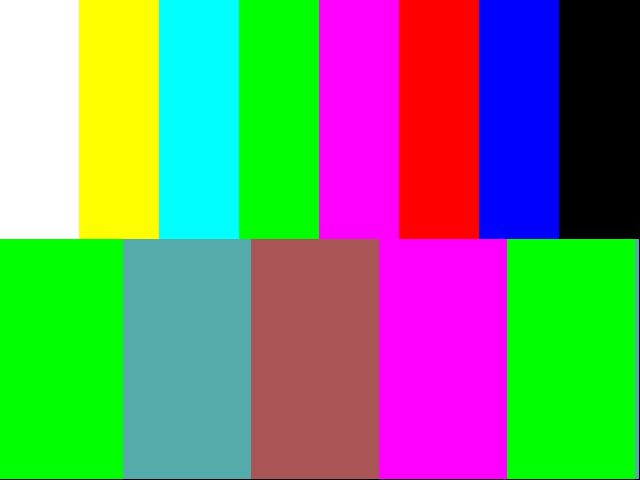

# Simulated `tt_um_vga_pattern` through the reconstruction library

Date: 2026-09-15. Not a hardware capture: the fpgas.online FPGA demo
`tt_um_vga_pattern` (640x480@60 colour bars over a scrolling 2-bit
gradient) simulated with Icarus Verilog, three frames, `uo_out` sampled on
the falling clock edge, wrapped as a `vgacap` stream and rendered.

```
cd tt-vga-testpatterns
uv run --no-project python tools/dump_uo_out.py --top tt_um_vga_pattern \
    --out tmp/vga_pattern_3f.bin --clocks 1260000 \
    <tinytapeout-fpga-demos>/demos/tt_um_vga_pattern/src/project.v \
    <tinytapeout-fpga-demos>/demos/tt_um_vga_pattern/src/hvsync_generator.v
cd ../vgacap
uv run vgacap-bin2stream ../tt-vga-testpatterns/tmp/vga_pattern_3f.bin \
    ../tt-vga-testpatterns/tmp/vga_pattern_3f.vgacap \
    --desc "iverilog tt_um_vga_pattern 3 frames" --clock-hz 25175000 --mode 2
./build/vgacap-frames ../tt-vga-testpatterns/tmp/vga_pattern_3f.vgacap tmp/vp
```

Output:

```
frame 0: 640x480 mode=640x480@60 cpl=800 lpf=525 hsync=neg vsync=neg partial=0
frames=1
```

Sampled pixels (x, y) -> RGB: (40,100) white, (120,100) yellow, (200,100)
cyan, (600,100) black, (100,300) (0,255,0), (300,300) (170,85,85),
(500,300) (255,0,255), all matching the design's formula (`red = level`,
`green = ~level`, `blue = {level[0], level[1]}` with `level = ramp[7:6]`).

`vgacap` commit df05c84, `tt-vga-testpatterns` commit 4b46387.



## Correction (2026-09-15, later the same day)

"Pixel-exact" above was verified only at bar centres. The M4 Task 1 review
found, and an edge check confirmed on this very frame, that the picture is
shifted by one pixel left and one line up relative to the design's intended
coordinates: the first bar boundary is at column 79 (not 80) and the
bars/gradient split at row 239 (not 240). The simulated frame shows the
identical shift, so the capture path reproduces the design's output
faithfully; the cause is the demo's `hvsync_generator` (shared with the
Tiny Tapeout VGA playground), whose hsync leading edge lands one clock late
and whose vsync edge is not aligned to an hsync edge, while `vgacap` places
pixels per VESA (active video starts `h_sync + h_back` clocks after the
hsync leading edge). Details: `tt-vga-testpatterns/docs/timing.md` and the
M4 Task 1 review.
