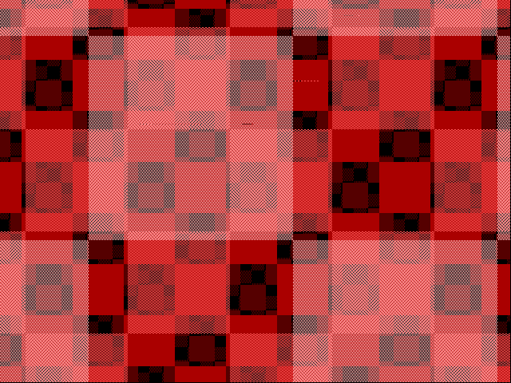

# `ttcap capture` over direct serial on the tt07 Pi (production path)

Date: 2026-09-15. `vgacap` 4783a08 cloned on pi-sw2-p7 (`UV_NO_DEV=1 uv sync`),
`fpgas-tt` stopped for the run and restarted afterwards.

```
sudo systemctl stop fpgas-tt
uv run --no-sync ttcap capture serial:/dev/ttboard --profile auto --project tt_um_rejunity_vga \
    --clock-hz 60000 --seconds 60 --frames 2 --buf-words 1024 --pio 1 --out tmp/tt07_checkers_serial.vgacap
sudo systemctl start fpgas-tt
```

```
profile=rp2040-tt06map project=tt_um_rejunity_vga enable=index
bytes=3360410 samples=1675264 chunks=819 seconds=28.377 overruns=0 dropped=0 rxstall=0 samples_per_s=59037 mem_free=82928
  board: overruns=0 rxstall=0 sysclk_hz=132000000
```

`--profile auto` read the board's GPIO map and picked the RP2040 layout;
the board self-stopped at the byte limit; the closing TIME chunk arrived.
Reconstructed on the workstation:

```
frame 0: 640x480 mode=640x480@60 cpl=800 lpf=525 hsync=pos vsync=pos partial=0
frames=1
```



One complete frame from 3.99 frames of samples: the timing learner needs
to see both phases of vsync before it can call the polarity, so the first
vsync pulse of a capture cannot start a frame, and the next one does; a
frame then needs the following pulse to close it. Improvement noted for
`libvgaframe`: decide the pulse at the end of the first short phase and
start the frame retroactively, which would save one frame per capture.
