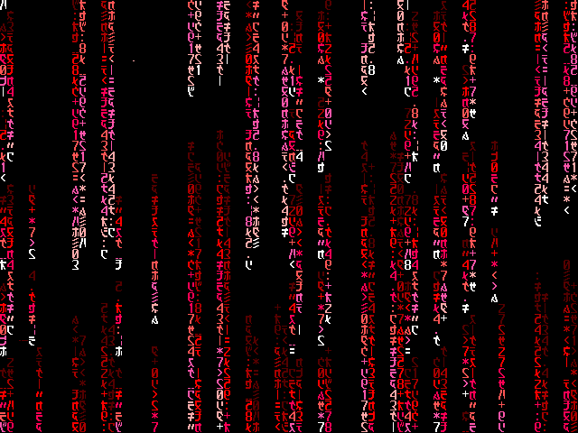

# `ttcap capture` on tt08: `tt_um_vga_glyph_mode` (Glyph Mode)

Date: 2026-09-15. tt08 chip on pi-sw2-p8 (Pi 3B+, RP2040 demo board, stock
firmware), `vgacap` 88b72eb on the Pi, direct serial with `fpgas-tt`
stopped for the run. Project clock 60 kHz, `--frames 2`.

```
profile=rp2040-tt06map project=tt_um_vga_glyph_mode enable=index
bytes=3360410 samples=1675264 chunks=819 seconds=28.372 overruns=0 dropped=0 rxstall=0 samples_per_s=59047 mem_free=79216
frame 0: 640x480 mode=640x480@60 cpl=800 lpf=525 hsync=pos vsync=pos partial=0
```



Falling "matrix" glyph columns in red/pink, as the project describes.
Both syncs positive on this design too. `capture.vgacap.gz` is the stream.
The same session's `tt_um_rejunity_vga_logo` capture produced no complete
frame: its hsync carries short spurious pulses (2 to 30 clocks, a few per
capture) that the timing learner currently counts as line starts; see
`TASKS.md` for the follow-up.
